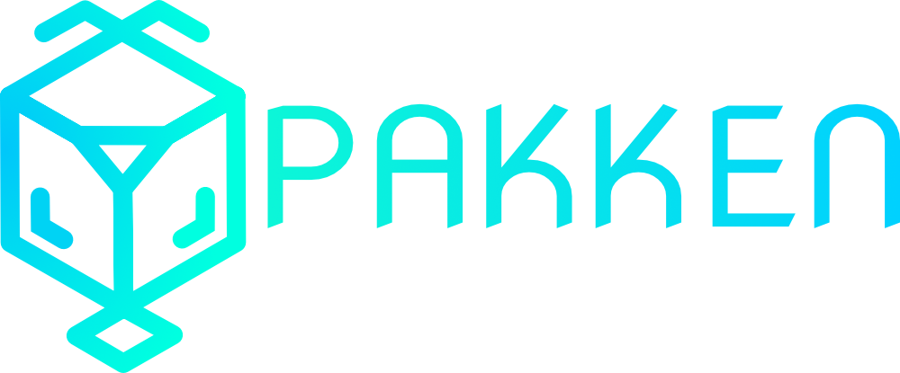

<p align="center">


# Pakken
</p>

[](https://github.com/kegesch/pakken/actions)
[](https://app.fossa.com/projects/git%2Bgithub.com%2Fkegesch%2Fpakken?ref=badge_shield)
[](https://hitsofcode.com/view/github/kegesch/pakken)

Pakken is a tool for software development. It aims to provide support to model and design the software with minimal coding effort known as "low code".
Meaning you design the model of the software and it can generate a basic boilerplate and implementation of the model. For instance it generates the boilerplate for a graphql backend and also generates components in React that automatically are in sync with the backend.

## The DSL
Yay, another DSL! But this is one is straight forward.
### Namespace
This defines the namespace / scope where the `Entity`s are living.
```Pakken
example.namespace.org {
    # here should be the Entitys
}
```
### Entity
An `Entity` can be a `Structure` an `Enum` or a `Scalar`(but those are inbuilt).
`Structures` can be declared like this: 
```Pakken
ExampleEntity : MyParent {
    attribute1: Entity [2,5], # Array of Entities with underbound 2 and upperbound 5
    attribute2: OtherEntity,
    operation1(param1: Entity): ResultingEntity
}
```

### Multiplicity of an Attribute
The multiplicity of attributes is optional. If no one is declared the parser assumes it as multiplicity `1`.
Other options are:
 * `[<int>]` means an array of the size of `<int>`
 * `[<int1>, <int2>]` means an array with under bound `<int1>` and upper bound `<int2`
 * `?` means optional -> `0` or `1` ()
 
## Building
Clone the repository and run `cargo build -p cli`. The binary can be found in `./target`.

## Executing
### Initiliazing a project
Run `cli new <projectname>`. This creates a folder `projectname` with following files:
 * `.pakken.ron`: This is the project file, containing project settings etc.
 * `projectname.pkn`: This is the model file for Pakken. This file describes the model with the DSL.

### Generating code for a target
Run `cli gen <targetname>`. This will generate the file structure described by the target along with the generated code.
It will also create a generator file `<targetname>.pgen` containing settings for the generation process.

## Roadmap
- [x] Develop a DSL that suits the needs
- [x] Build a Parser for that DSL
- [x] Start to develop a CLI for the tool
- [ ] Basic implementation of a workflow (MVP)
  - [x] Design architecture for the different targets 
  - [ ] Implement one example target
  - [ ] Think about glueing different targets together
  - [ ] Evaluate how [Conjure](https://github.com/palantir/conjure) plays with this
- [ ] Evaluate this concept and change accordingly
- [ ] Refactor code base according to the new plan
- [ ] Write documentation
- [ ] Implement new targets

## Possible Targets
A target is a language / framework / platform which the code should be generated to.
- [ ] Databases
  - [ ] SQL
- [ ] Endpoints
  - [ ] Rest
  - [ ] GraphQL
- [ ] Client Frameworks
  - [ ] React
  - [ ] Angular
  - [ ] Vue.js
- [ ] Languages
  - [ ] JavaScript
  - [ ] TypeScript
  - [ ] Java
  - [ ] C#
  - [ ] Rust

## Contributing
Although contributing is very welcome. At the moment this project is not yet planned.
If you are interested about this project / low-code or code-generation in general, feel free to submit an issue with your wishes or expectations.

## License
[](https://app.fossa.io/projects/git%2Bgithub.com%2Fkegesch%2Fpakken?ref=badge_large)